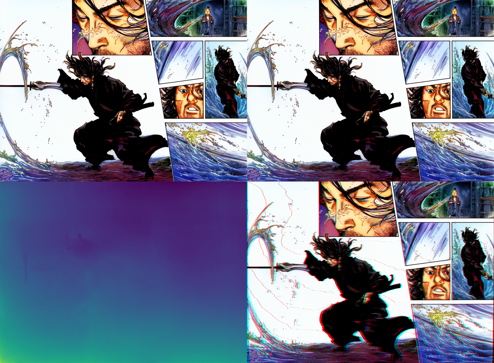

# 🎨 Manga 3D Color

Transform black & white manga pages into **colorized 3D parallax** experiences.


## What it does

1. **Colorize** — AI-powered colorization of B&W manga pages using [manga-colorization-v2](https://github.com/qweasdd/manga-colorization-v2)
2. **Depth Map** — Generate depth maps using [Apple Depth Pro](https://github.com/apple/ml-depth-pro)
3. **3D Parallax** — WebGL reader with real-time parallax, multiple view modes, and page navigation

## Examples

<table>
<tr>
<td align="center"><b>One Piece (Luffy)</b></td>
<td align="center"><b>Vagabond</b></td>
</tr>
<tr>
<td></td>
<td></td>
</tr>
<tr>
<td align="center"><b>Colorized</b></td>
<td align="center"><b>Depth Map</b></td>
</tr>
<tr>
<td></td>
<td></td>
</tr>
<tr>
<td></td>
<td></td>
</tr>
</table>

## Quick Start

### Prerequisites

- Python 3.9+ with conda/mamba
- Node.js 18+
- macOS (Apple Silicon recommended for MPS acceleration) or Linux with CUDA

### 1. Clone & setup

```bash
git clone https://github.com/jrubiosainz/manga-3d-color.git
cd manga-3d-color
```

### 2. Install Python dependencies

```bash
# Create conda environment
conda create -n manga3d python=3.11 -y
conda activate manga3d

# Install PyTorch (macOS)
pip install torch torchvision

# Install dependencies
pip install -r requirements.txt

# Clone and install colorizer
git clone https://github.com/qweasdd/manga-colorization-v2.git
cd manga-colorization-v2
# Download model weights (see their README)
cd ..

# Clone and install depth estimation
git clone https://github.com/apple/ml-depth-pro.git
cd ml-depth-pro
pip install -e .
cd ..
```

### 3. Process manga pages

```bash
# Single image
python pipeline/manga_pipeline.py image.jpg

# Folder of images
python pipeline/manga_pipeline.py ./my-manga-pages/

# PDF
python pipeline/manga_pipeline.py manga.pdf

# Only colorize (skip depth)
python pipeline/manga_pipeline.py image.jpg --steps color
```

Output goes to `output/<basename>/` with:
- `*_color.png` — Colorized version
- `*_depth.png` — Depth map
- `*_3d.png` — 3D composite
- `*_3d_comparison.png` — Side-by-side comparison (B&W vs Color vs Depth)

### 4. Launch the 3D Reader

```bash
cd reader
npm install
npm start
```

Open `http://localhost:3002` and drag & drop your processed pages, or:

```
http://localhost:3002?folder=luffy
http://localhost:3002?folders=luffy,vagabond
```

## 3D Reader Features

- **WebGL parallax engine** — Real-time depth-based parallax effect
- **5 view modes** — Parallax, Layers, Depth map, Color only, Side-by-side
- **Mouse/touch/gyroscope tracking** — Shift perspective naturally
- **Auto-move mode** — Gentle automatic parallax animation
- **Multi-page navigation** — Thumbnail strip + keyboard shortcuts
- **Adjustable parameters** — Focus plane, layer count, parallax intensity
- **Export** — Save current 3D view as PNG
- **Drag & drop** — Load local images without server

**Keyboard shortcuts:** `←` `→` navigate pages · `Space` toggle auto-move · `F` fullscreen

## Architecture

```
manga-3d-color/
├── pipeline/
│   └── manga_pipeline.py    # Core processing pipeline
├── reader/
│   ├── server.js            # Express server
│   └── public/
│       └── index.html       # WebGL 3D reader (single-file SPA)
├── output/                   # Generated output (git-ignored)
├── requirements.txt
└── README.md
```

### Pipeline Flow

```
B&W Manga Page
    │
    ├──► manga-colorization-v2 ──► Color Image
    │
    └──► Apple Depth Pro ──► Depth Map
                                  │
                                  ▼
                        WebGL Parallax Reader
                        (color + depth = 3D!)
```

## Performance

On Apple Silicon (MPS):

| Step | Time/Page | Memory |
|------|-----------|--------|
| Colorization | ~3s | ~1GB |
| Depth estimation | ~14s | ~2GB |
| **Total** | **~17s** | **~3GB** |

## Programmatic API

```python
from pipeline.manga_pipeline import process_image

result = process_image('input.jpg', output_dir='./output')
# {'color': '...', 'depth': '...', '3d': '...'}
```

## Credits

- [manga-colorization-v2](https://github.com/qweasdd/manga-colorization-v2) — AI manga colorization
- [Apple Depth Pro](https://github.com/apple/ml-depth-pro) — Monocular depth estimation

## License

MIT
